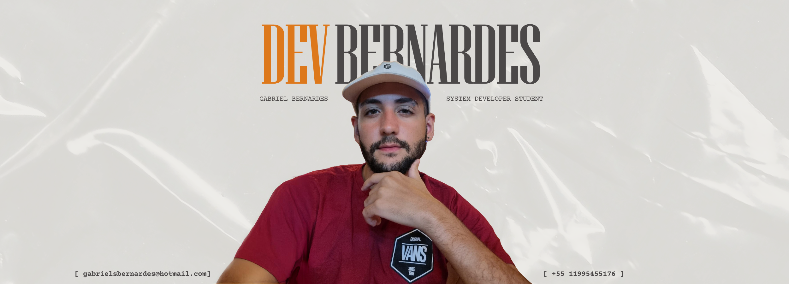
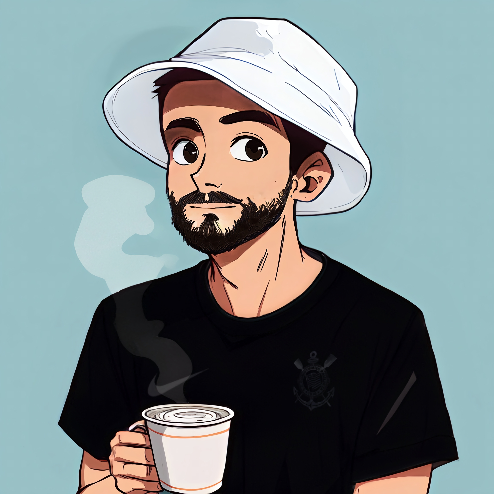

  
  <h1>Gabriel Bernardes</h1>

  

    

      
      
      
    

  <h2>🚀 Tecnologias & Ferramentas</h2>
    

      
      
      
      
      
      
      
      
      
      
    

  

    <h2>👨‍💻 Sobre Mim</h2>
      

        Software developer student apaixonado por tecnologia e inovação. Sempre em busca de novos desafios e aprendizados.
        Experiência em desenvolvimento web, com foco em Java Script, Html e Css.
      

  

  

    
  

  

    <h2>🌟 Principais Projetos</h2>
      

        
        
      

  

  

    <h2>📱 Contatos</h2>
      

        
        
        
      

  

  

      <picture>
        <source media="(prefers-color-scheme: dark)" srcset="https://raw.githubusercontent.com/devbernardes/devbernardes/output/github-contribution-grid-snake-dark.svg">
        <source media="(prefers-color-scheme: light)" srcset="https://raw.githubusercontent.com/devbernardes/devbernardes/output/github-contribution-grid-snake.svg">
        
      </picture>
  

  

   
<b>Visitors Count</b>
  
  

 

